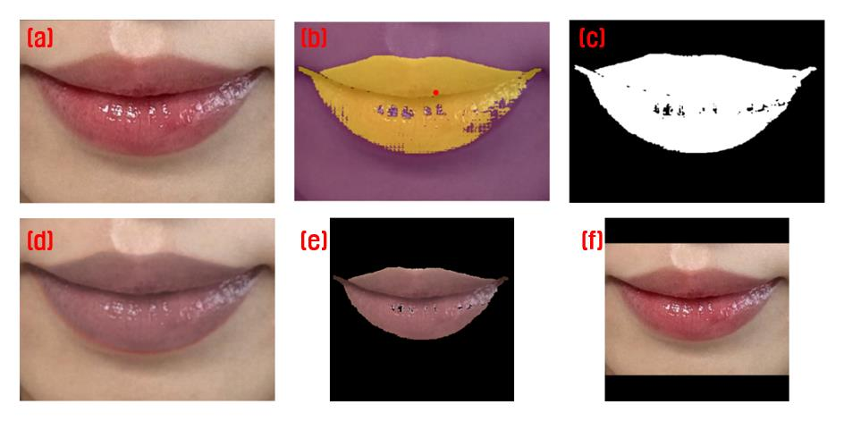
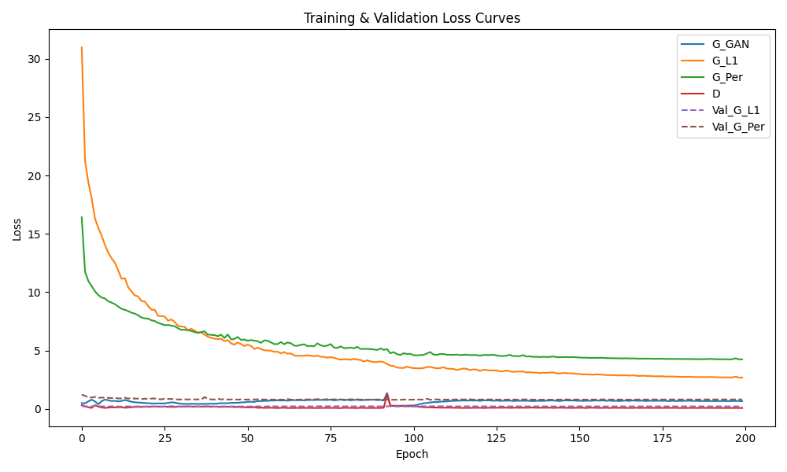
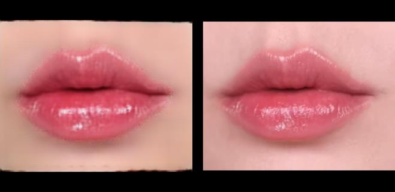
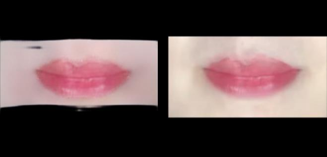
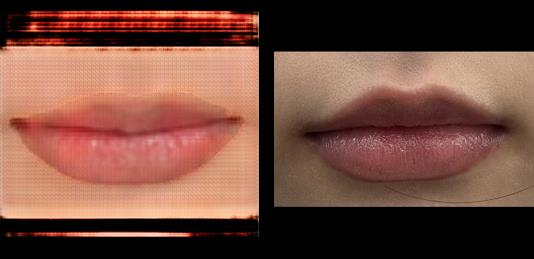

# Lip-tint transfer with pix2pix

Apply the color of one lip tint (rom&nd Juicy Lasting Tint, Bare Grape) to a photo of bare lips. Course project, Artificial Intelligence, Pusan National University, June 2025. The course report (Korean) is in `report/`.

No paired photos of the same lips with and without the tint exist, so most of the work is building the paired dataset from tinted photos alone.

## Data pipeline (`prepare/`)

<p align="center"></p>

1. **Collect.** About 200 tinted-lip crops of 44 people from YouTube and blog reviews of the product.
2. **Mask** (`mask_sam.py`). Click one point on the lips; Segment Anything proposes three masks, one is kept, then cleaned by blur and re-thresholding. Masks were refined by hand in Krita where SAM bled into skin.
3. **Synthesize the bare lip** (`bare_lip.py`). Inside the mask, scale saturation and value down in HSV (less for pixels that are already dull), fill specular highlights with the mean lip color, and blur. This gives the input image; the tinted photo is the target.
4. **Augment** (`augment.py`). People have 1–20 photos, so each is topped up to 15 pairs with translations, a flip, a zoom and brightness shifts applied identically to image, mask and target: 187 → 516 pairs.
5. **Pack** (`build_pairs.py`). Pad to a square with black borders (no aspect distortion), resize to 256×256, and store the input as RGBA with the mask in the alpha channel so the generator sees where the lips are.

```bash
python prepare/mask_sam.py data/raw/<person> --checkpoint sam_vit_b_01ec64.pth
python prepare/bare_lip.py data/raw data/pairs
python prepare/augment.py data/pairs --per-person 15
python prepare/build_pairs.py data/pairs data/dataset --val 0.2
python train.py data/dataset --epochs 200
```

## Model (`pix2pix.py`, `train.py`)

pix2pix as in Isola et al. (2017): U-Net generator (4 → 3 channels, 8 down / 8 up), 70×70 PatchGAN discriminator, LSGAN objective. Loss = GAN + 100·L1 + 10·VGG19 perceptual, Adam 2e-4 (β₁ 0.5), batch 4, 200 epochs with linear decay after 100. The report describes the L1-only configuration; the code here is the last version that was run and includes the perceptual term.

<p align="center"></p>

Loss curves over 200 epochs. G_GAN: generator adversarial loss; G_L1: 100·L1; G_Per: 10·perceptual; D: discriminator; Val_G_L1 / Val_G_Per: the same two terms on the validation set.

## Results

Generated (left) vs. real tinted lips (right).

| Person seen in training, new photo | New person, low resolution | New person, high resolution |
|---|---|---|
|  |  |  |

The dataset itself (third-party photos) and checkpoints are not in this repository. The tint color and its intensity are reproduced. Three failure modes recur: lips look flat (highlights and volume are lost), the lip boundary is jagged, and a reddish cast spreads outside the lips. The black padding is also mistaken for skin near the border ([example](figures/padding_vs_outpainting.png)). Evaluation is visual only; no FID/SSIM.

The main limitation is the synthetic bare lip: HSV desaturation removes texture and volume together with the color, so the model never sees real bare-lip structure.
